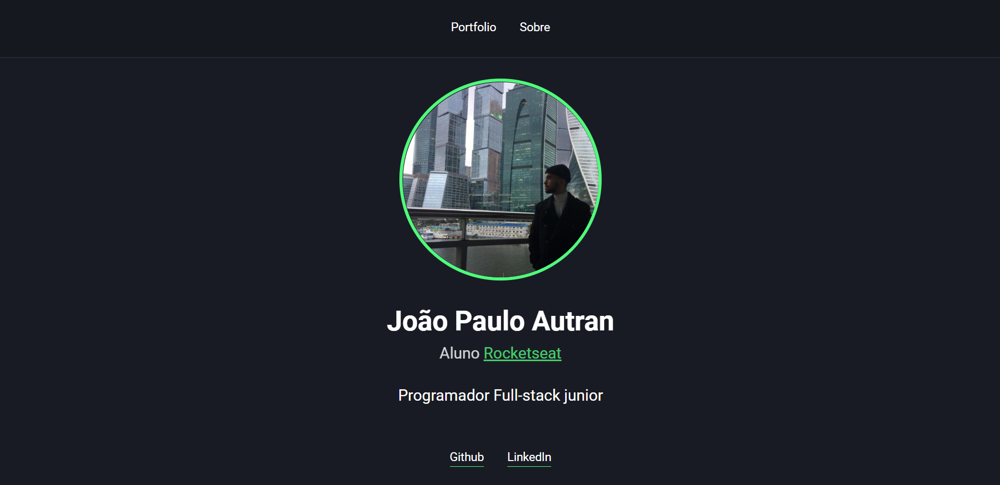
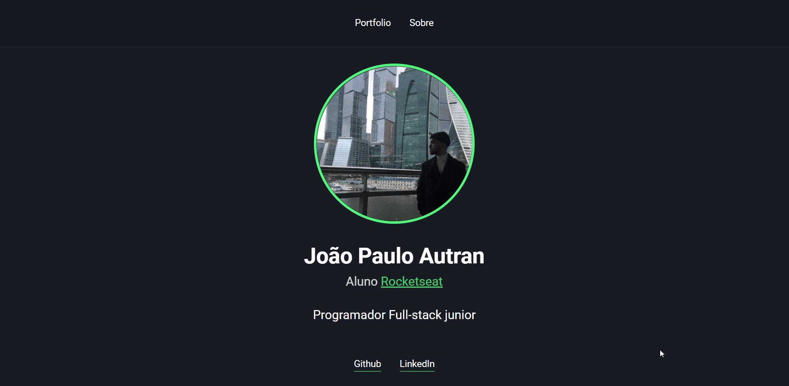

<h1 align="center">
    Portfolio
</h1>

<h1>

</h1>

# 📋 About

A self portfolio. <br />
In this challenge I created a portfolio for myself, showing some of my projects and links to acess my Github and LinkedIn pages. I used the view engine Nunjucks and also created a server with Node.js

<h1>

</h1>

# 💻 Features 

This project was developed with:
- [HTML](https://developer.mozilla.org/en-US/docs/Web/HTML)
- [CSS](https://developer.mozilla.org/en-US/docs/Web/CSS)
- [JavaScript](https://developer.mozilla.org/en-US/docs/Learn/Getting_started_with_the_web/JavaScript_basics)
- [Node.js](https://nodejs.org/en/)
- [Express](https://expressjs.com/pt-br/)
- [Nunjucks](https://mozilla.github.io/nunjucks/)

---

# 📂 Getting started
```bash

# Clone this repository using
$ git clone https://github.com/jpautran/portfolio01

# Move yourself to the directory
$ cd file/path

# Install the dependencies
$ npm install

# Start with
$ npm start

```

---

<h3 align="center">
Developed by João Paulo Autran 🚀
</h3>            